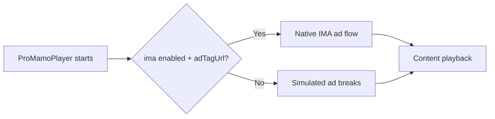

# Ads Monetization

This page explains the ad monetization paths in `@mamoplayer/pro`, from simulated ad breaks to native Google IMA integration.

## 1. Overview

- **Simulated Ads (Phase 2)**
  - Uses regular video assets as ad creatives through the `ads` prop.
  - Best for local demos, deterministic QA, and fallback playback behavior.
- **Native IMA Ads (Phase 3)**
  - Uses the `ima` prop to serve ads from a VAST/IMA ad tag URL.
  - Best for production ad serving and native ad lifecycle handling.



## 2. Simulated Ads

### `AdsConfig`

```ts
type AdsConfig = {
  adBreaks: AdBreak[];
  skipButtonEnabled?: boolean;
  skipAfterSeconds?: number;
};
```

### `AdBreak`, `AdSource`

```ts
type AdSource = {
  uri: string;
  type?: 'video/mp4' | 'application/x-mpegURL';
};

type AdBreak = {
  type: 'preroll' | 'midroll' | 'postroll';
  time?: number; // only for midroll
  source: AdSource;
};
```

### Pre-roll, Mid-roll, Post-roll behavior

- **Pre-roll (`preroll`)**
  - Plays before main content starts.
- **Mid-roll (`midroll`)**
  - Plays when content playback reaches the configured `time` (seconds).
  - Triggered once per configured break.
- **Post-roll (`postroll`)**
  - Plays after main content completes.
- **Skip controls**
  - If `skipButtonEnabled` is `true`, skip UI is shown.
  - `skipAfterSeconds` delays user-initiated skip until the countdown finishes.

### Example configuration

```tsx
import { ProMamoPlayer } from '@mamoplayer/pro';

<ProMamoPlayer
  source={{ uri: 'https://cdn.example.com/content/main.mp4' }}
  ads={{
    adBreaks: [
      { type: 'preroll', source: { uri: 'https://cdn.example.com/ads/pre.mp4' } },
      {
        type: 'midroll',
        time: 120,
        source: { uri: 'https://cdn.example.com/ads/mid.m3u8', type: 'application/x-mpegURL' },
      },
      { type: 'postroll', source: { uri: 'https://cdn.example.com/ads/post.mp4' } },
    ],
    skipButtonEnabled: true,
    skipAfterSeconds: 5,
  }}
/>;
```

## 3. Native IMA

### `IMAConfig` (`ima` prop)

```ts
type IMAConfig = {
  enabled: boolean;
  adTagUrl: string;
};
```

### Requirements

- **Runtime**
  - Use a custom dev client or bare React Native app.
  - Use a native runtime build for native IMA.
- **Native setup**
  - Follow the Android and iOS setup in the repository README:
    - [Native IMA Integration (Phase 3)](../README.md#native-ima-integration-phase-3)
    - [Android Gradle setup](../README.md#android-gradle-setup)
    - [iOS Podfile setup](../README.md#ios-podfile-setup)

### Example usage (IMA-based ads)

```tsx
import { ProMamoPlayer } from '@mamoplayer/pro';

<ProMamoPlayer
  source={{ uri: 'https://cdn.example.com/content/main.mp4' }}
  ima={{
    enabled: true,
    adTagUrl:
      'https://pubads.g.doubleclick.net/gampad/ads?iu=/21775744923/external/single_ad_samples&sz=640x480&gdfp_req=1&output=vast&env=vp&impl=s&correlator=',
  }}
  analytics={{
    sessionId: 'session-ima-001',
    onEvent: (event) => console.log('[analytics]', event.type, event.position),
  }}
/>;
```

## 4. Analytics with Ads

When `analytics.onEvent` is enabled, ad-related telemetry includes:

- `ad_start`
  - Emitted when an ad break begins.
  - Useful for ad impression-start and fill tracking.
- `ad_complete`
  - Emitted when an ad break ends (including skip-complete flows).
  - Useful for completion rate and monetizable view-through tracking.
- `ad_error`
  - Emitted when ad playback fails.
  - Useful for error-rate monitoring, fallback diagnostics, and revenue loss estimation.

### Connecting events to business metrics

- **Fill health**: compare `ad_start` volume against playback sessions.
- **Completion KPI**: compute `ad_complete / ad_start` by placement (`preroll`, `midroll`, `postroll`).
- **Reliability KPI**: compute `ad_error / ad_start` to track integration or inventory quality.
- **Revenue modeling**: combine ad starts/completions with CPM rules and placement weighting.
